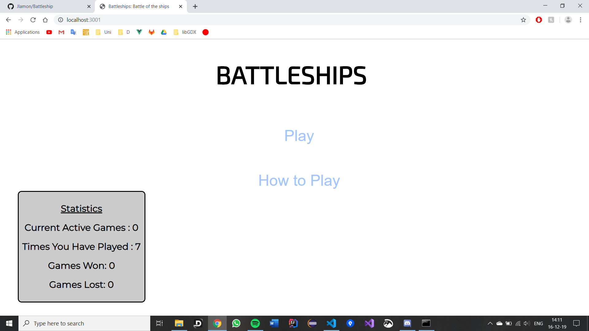
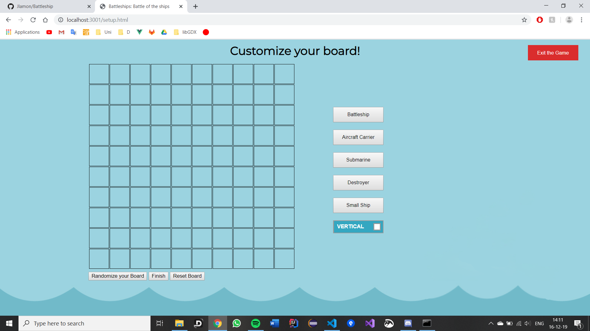
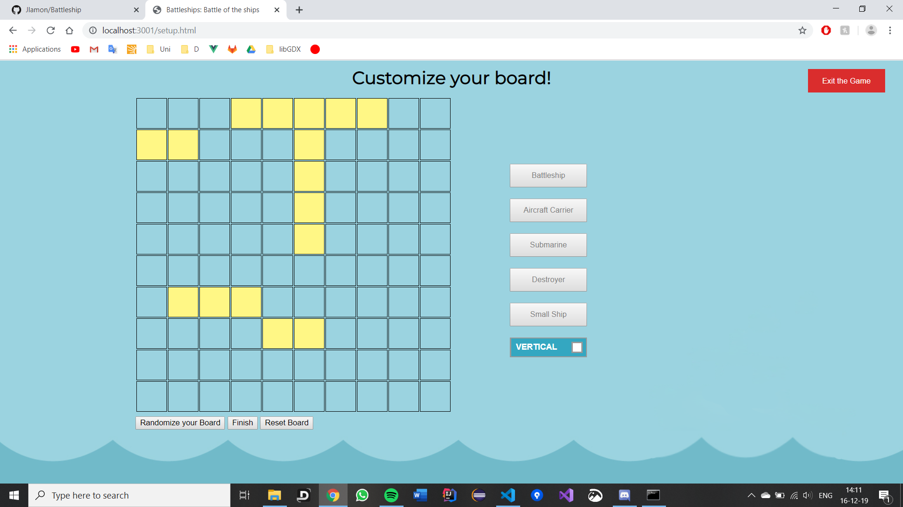
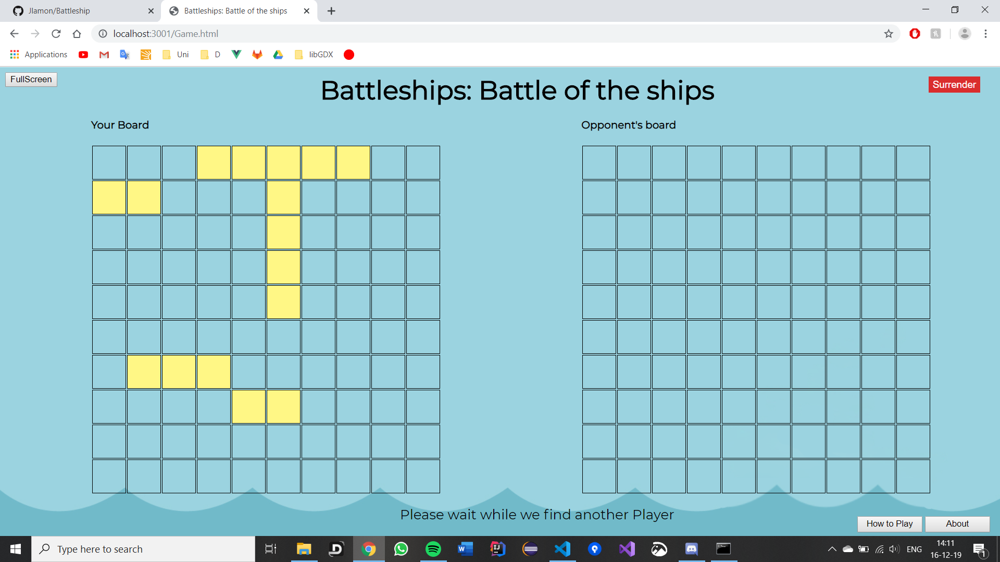

# Battleship

Battleship is a game created with Waqas Abbasi for the course "Web and Database technology".

## Startup of the game

In the Command Promt, go to the repository containing the file "app.js". Then, write this

```bash
node app.js
```

In a browser, use this LocalHost

```bash
localhost:3001
```

## Design

NOTE !! The background image has to be fixed. Might be done later.

### Splash Screen




### Set Up Screen





### Game Screen

